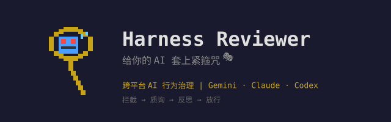

<p align="center">
  
</p>

<p align="center">
  <strong>给你的 AI 助手套上"紧箍咒"</strong><br/>
  跨平台 AI Agent Skill · 让 AI 学会三思而后行
</p>

<p align="center">
  
  
  
  
</p>

---

## 这是什么？

这是一个 **Agent Skill**（AI 代理技能），通过各平台的 Hook 机制自动注入到 AI 的工作流中。它不是一个独立应用，而是寄生在你已有的 AI 工具（Gemini CLI / Claude Code / Codex CLI）上的治理层。

**工作方式：** 每当 AI 完成一轮输出准备交付时，Skill 自动拦截并审计输出质量，要求 AI 进行自我检查后才放行。

**兼容平台：**
| 平台 | Skill 机制 | Hook 事件 |
|------|-----------|-----------|
| Gemini CLI | [Agent Skills](https://geminicli.com/docs/cli/tutorials/skills-getting-started/) | `AfterAgent` |
| Claude Code | [Hooks](https://code.claude.com/docs/en/hooks) | `Stop` |
| Codex CLI | [Hooks](https://developers.openai.com/codex/hooks/) | `Stop` |

## 😤 问题

你的 AI 助手是不是这样的：

- 方案写完就交，从不回头检查
- 修 bug 只贴创可贴，不找根因
- 代码越写越复杂，KISS 原则是什么？能吃吗？
- 你说"帮我重构"，它给你堆了三层抽象

## 💡 方案

请一位**铁面判官**坐镇。每当 AI 准备交付时，判官跳出来灵魂拷问：

> 🤔 "你真的找到问题根源了吗？还是在贴创可贴？"
>
> 🧐 "交卷之前，你重新检查过逻辑冲突没？"
>
> 🪞 "这玩意儿符合 KISS 原则吗？还是在炫技？"

AI 必须老老实实做完自我反思，判官才会放行。

## 🔄 工作流程

<table>
<tr>
<td align="center" width="160">
<br/>
<strong>1. 判官拦截</strong><br/>
<sub>AI 交方案，判官跳出来</sub>
</td>
<td align="center" width="40">➡️</td>
<td align="center" width="160">
<br/>
<strong>2. 灵魂质询</strong><br/>
<sub>AI 被迫自我反思</sub>
</td>
<td align="center" width="40">➡️</td>
<td align="center" width="160">
<br/>
<strong>3. 审核通过</strong><br/>
<sub>反思合格，放行 ✅</sub>
</td>
</tr>
</table>

```
AI 输出方案 → 判官拦截 🚨 → 灵魂质询 🔥 → AI 自我反思 → 合格放行 ✅
                                                         ↑
                                              不合格？打回重来 🔄
```

## ⚡ 快速开始

### 方式一：作为 Skill 使用（推荐）

**Gemini CLI：**
```bash
# 将此仓库 clone 到 Gemini 的 skills 目录
git clone https://github.com/user/harness-reviewer.git ~/.gemini/skills/harness-reviewer
# 安装 hook
node ~/.gemini/skills/harness-reviewer/scripts/install.cjs
```

**Claude Code：**
```bash
# 将此仓库 clone 到 Claude 的 skills 目录
git clone https://github.com/user/harness-reviewer.git ~/.claude/skills/harness-reviewer
# 安装 hook
node ~/.claude/skills/harness-reviewer/scripts/install.cjs
```

**Codex CLI：**
```bash
# 将此仓库 clone 到 Codex 的 skills 目录
git clone https://github.com/user/harness-reviewer.git ~/.codex/skills/harness-reviewer
# 安装 hook
node ~/.codex/skills/harness-reviewer/scripts/install.cjs
```

### 方式二：独立安装

```bash
# Clone 到任意位置
git clone https://github.com/user/harness-reviewer.git
cd harness-reviewer
node scripts/install.cjs
```

### 配置（可选）

默认配置开箱即用（regex 模式，三平台全部启用）。如需自定义：

```bash
# 编辑默认配置
vim harness.config.json

# 或创建本地覆盖（不会被 git 追踪，适合填 API Key）
cp harness.config.example.json harness.config.local.json
vim harness.config.local.json
```

配置结构：

```json
{
  "platforms": {
    "gemini": { "enabled": true, "scope": "project" },
    "claude": { "enabled": true, "scope": "project" },
    "codex":  { "enabled": true, "scope": "global" }
  },
  "audit": {
    "mode": "regex"
  }
}
```

- `enabled`: 是否为该平台安装 hook
- `scope`: `"project"`（写入当前目录的 `.gemini/` 或 `.claude/`）或 `"global"`（写入 `~/` 下的全局配置）
- `mode`: `"regex"`（免费零延迟）或 `"llm"`（语义审计，需配置 API Key）

### 安装

```bash
node scripts/install.cjs
```

### 查看状态

```bash
node scripts/status.cjs
```

输出示例：
```
📡 Platform Status:
   Gemini CLI
     Config:    ✅ enabled
     Installed: ✅ hook found
     Scope:     project

   Claude Code
     Config:    ✅ enabled
     Installed: ✅ hook found
     Scope:     project

   Codex CLI
     Config:    ✅ enabled
     Installed: ✅ hook found
     Scope:     global
```

### 安装后注意

| 平台 | 首次使用 |
|------|----------|
| Gemini CLI | 首次触发时需要确认信任 hook |
| Claude Code | 立即生效 |
| Codex CLI | 运行 `/hooks` 命令信任 hook |

## 🎛️ 两种审计模式

| 模式 | 原理 | 延迟 | 成本 | 适合 |
|------|------|------|------|------|
| `regex` | 本地多信号打分（结构/意图/长度） | ~0ms | 免费 | 日常开发 |
| `llm` | 外部 LLM 语义审计 | ~2-5s | 按调用计费 | 重要项目 |

regex 模式不是简单的关键词匹配——它综合分析输出的结构信号、意图信号和长度信号进行打分，只在"看起来像交付方案"时才触发拦截。日常闲聊不会被打扰。

### 启用 LLM 模式

```bash
cp harness.config.example.json harness.config.local.json
```

编辑 `harness.config.local.json`，设置 `mode` 为 `"llm"` 并填入 API Key：

```json
{
  "audit": {
    "mode": "llm",
    "llm_config": {
      "provider": "openai",
      "model": "qwen/qwen3.6-plus-preview:free",
      "api_key": "your-key-here",
      "endpoint": "https://openrouter.ai/api/v1/chat/completions"
    }
  }
}
```

兼容所有 OpenAI Chat Completions API 格式的服务（OpenRouter / OpenAI / Ollama / vLLM / LocalAI）。

## 📝 自定义规则

所有治理规则集中在 [`rules.md`](rules.md) 一个文件里：

- 想让判官更严厉？加规则
- 想让判官更温柔？删规则
- 想换质询风格？改措辞

**即改即生效**，无需重新安装。Hook 直接引用源文件。

## 📁 项目结构

```
harness-reviewer/
├── scripts/
│   ├── install.cjs                    ← 安装器（按配置注册 hook）
│   ├── status.cjs                     ← 状态检查
│   ├── harness-main.cjs              ← 审计内核
│   └── llm-client.cjs                ← LLM 调用客户端
├── harness.config.json                ← 默认配置（提交到 git）
├── harness.config.local.json          ← 本地覆盖（gitignored，放 API Key）
├── harness.config.example.json        ← LLM 模式配置示例
├── rules.md                           ← 治理规则（判官的灵魂）
├── SKILL.md                           ← 技能元数据
└── README.md                          ← 你在这里 👋
```

## ❓ FAQ

<details>
<summary><b>AI 被拦截后怎么办？</b></summary>

AI 需要根据质询进行自我反思，回复中包含实质性的反思内容后说"已自检"即可放行。注意：光说"已自检"三个字不够，判官（LLM 模式下）会检查反思的深度。
</details>

<details>
<summary><b>会不会太烦？</b></summary>

不会。只有当输出"看起来像在交付方案"时才触发（打分 ≥ 4 分）。问个问题、聊个天、看个报告，都不会被拦。
</details>

<details>
<summary><b>regex 模式会误判吗？</b></summary>

偶尔会。它用多信号打分来降低误判率：结构（标题/列表/代码块）、意图（关键动词）、长度，还有负信号（表格、过去时态）来排除报告类输出。如果觉得不够准，切 LLM 模式。
</details>

<details>
<summary><b>支持哪些 LLM 服务？</b></summary>

任何兼容 OpenAI Chat Completions API 的服务都行：OpenRouter、OpenAI、Azure OpenAI、Ollama、vLLM、LocalAI……
</details>

<details>
<summary><b>规则改了需要重新安装吗？</b></summary>

不需要。Hook 直接引用源文件路径，改完 `rules.md` 立即生效。
</details>

<details>
<summary><b>怎么只给某个平台装？</b></summary>

编辑 `harness.config.json`，把不需要的平台 `enabled` 设为 `false`，然后重新 `node scripts/install.cjs`。
</details>

<details>
<summary><b>project scope 和 global scope 有什么区别？</b></summary>

- `project`: hook 只在当前项目目录生效（写入 `.gemini/settings.json` 或 `.claude/settings.json`）
- `global`: hook 对所有项目生效（写入 `~/.gemini/settings.json` 或 `~/.claude/settings.json`）
- Codex 只支持 global scope
</details>

## 🤝 贡献

欢迎 PR。改规则、加平台支持、优化打分逻辑，都行。

## 📄 License

[MIT](LICENSE) — 随便用，记得也给你的 AI 套一个。🪢
